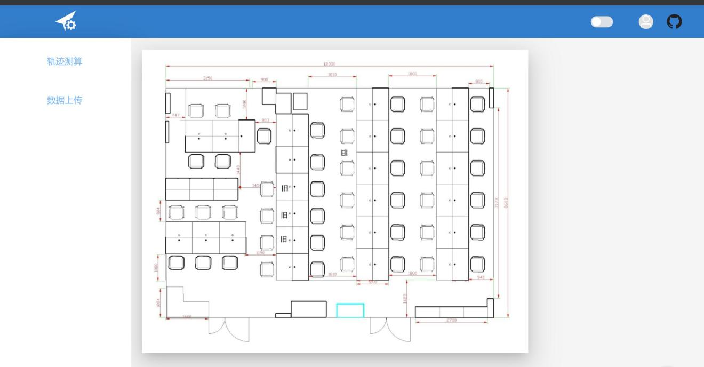
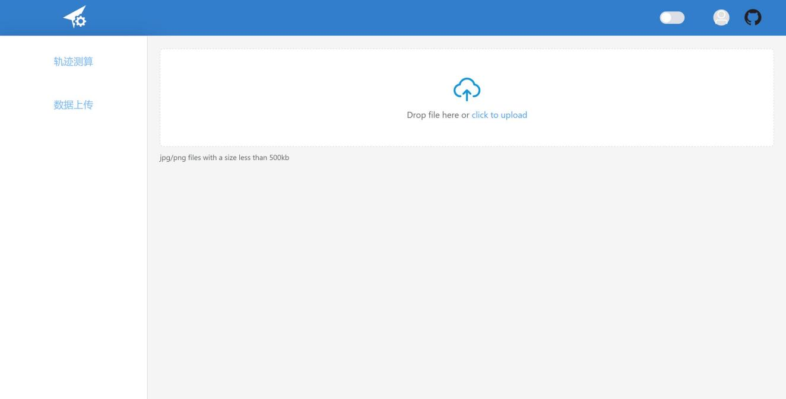
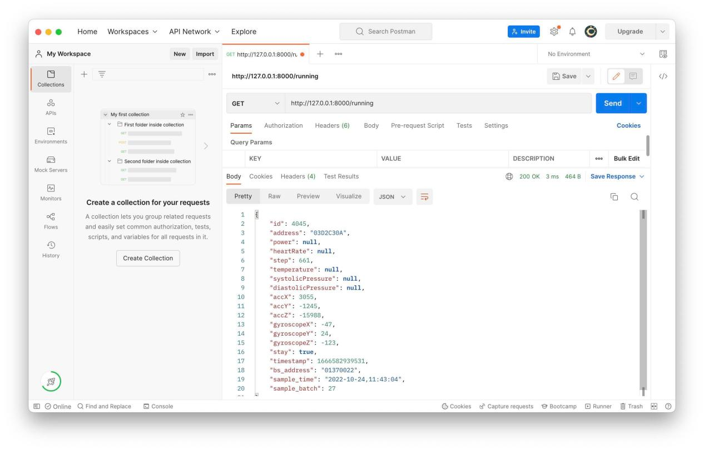
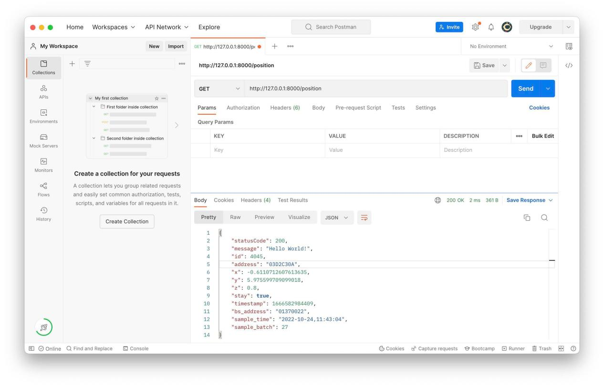
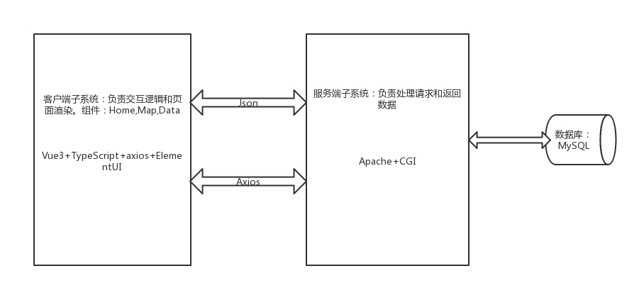

# 室内行人定位轨迹的校正与可视化B/S系统
<h1 align="center">华中科技大学《软件课程设计》中期报告</h1>
<table border="1" align="center">
	<tr>
		<td>实验名称</td>
		<td colspan="3">室内行人定位轨迹的校正方法与可视化系统的设计与开发</td>
	</tr>
 <tr>
  <td>院（系）</td>
  <td colspan="3">电子信息与通信学院</td>
 </tr>
 <tr>
  <td>专业班级</td>
  <td colspan="3">提高2001班</td>
 </tr>
 <tr>
  <td>姓名</td>
  <td>胡志杰</td>
  <td>蒋艺</td>
  <td>王李懿</td>
 </tr>
 <tr>
  <td>学号</td>
  <td>U202013833</td>
  <td>U202013834</td>
  <td>U202013850</td>
 </tr>
<tr>
  <td>时间</td>
  <td colspan="3"></td>
 </tr>
 <tr>
  <td>指导老师</td>
  <td colspan="3">王邦</td>
 </tr>
</table>

## 项目名称
名称：室内行人定位轨迹的校正方法与可视化系统的设计与开发。  
描述：设计一个B/S系统，实现对室内行人定位轨迹的校正，并在网页上实现轨迹的可视化。自选编程语言与小组成员合作开发完成设计任务。
## 项目背景
### 室内定位（Indoor Localization）
随着智能设备的普及，基于位置的服务（LBS）成为人们日常生活中必不可少的一部分。现代人有80%的时间是在室内度过的。如何在室内环境中准确地确定用户的位置，成为近年来的一个热门研究课题。 
在室外空间，以GPS、北斗为代表的卫星定位系统能够满足人们在户外开阔环境中的定位需求；但在室内环境中，由于建筑结构、室内障碍物对卫星信号的阻挡和反射，卫星定位系统会产生较大的定位误差。 
因此，研究者们提出了多种基于无线信号的室内定位方案，利用的信号包括Wi-Fi、蓝牙、超声波、超宽带、惯性传感器、红外线、声信号等。
## 需求分析
1. 合理设计网页布局，包括：室内地图区、信息显示区、定位指标计算区等；设计一个菜单作为初始界面。 
2. 在室内地图区，需要呈现室内平面图、行人真实轨迹和定位轨迹。用户能够通过点击定位轨迹中的点，查看不同位置的传感器信息（三轴加速度、角速度等）和行人航位信息（位移和航向），并在信息显示区显示。
3. 在定位指标计算区，需要实时计算并展示当前定位轨迹的平均定位误差、百分位定位误差、CDF曲线等定位指标。
4. 系统需通过数据库实现信息的存储与交互。
5. 定位轨迹至少需要实现两种： 
  * 直接定位点的轨迹。
  * 使用一个直接定位点作为初始点，实现PDR的基础算法来估计行人轨迹。
6. 软件系统可以通过上传csv文件（格式见数据文件），实时计算PDR算法的定位结果，绘制定位轨迹，显示定位指标。
## 实施方案论证
### 前端子系统
前端技术栈：Vue3 +ElementUI+ TypeScript + Axios
1. Vue3:前端程序框架 
Vue 是一套用于构建用户界面的渐进式框架。与其它大型框架不同的是，Vue 被设计为可以自底向上逐层应用。Vue 的核心库只关注视图层，不仅易于上手，还便于与第三方库或既有项目整合。另一方面，当与现代化的工具链以及各种支持类库结合使用时，Vue 也完全能够为复杂的单页应用提供驱动。
2. ElementUI:前端组件库  
Element 是基于 Vue 实现的一套不依赖业务的 UI 组件库，提供了丰富的 PC 端组件，减少用户对常用组件的封装，降低了开发的难易程度。
3. TypeScript：网页编程  
TypeScript是一种由微软开发的自由和开源的编程语言。它是JavaScript的一个超集，而且本质上向这个语言添加了可选的静态类型和基于类的面向对象编程。向JavaScript添加静态类型，您可以避免经典的错误 'undefined' is not a function.在不严重破坏代码的情况下，重构代码更容易。使大型、复杂的应用程序源码更易阅读。
4. Axios：前端与服务器通信使用的框架  
前端通信框架，因为vue的边界很明确，就是为了处理DOM，所以并不具备通信功能，此时就需要额外使用一个通信框架与服务器交互.j

### 后端子系统
后端技术栈：Apache + CGICC + MySQL
1. [Apache](https://ubuntu.com/tutorials/install-and-configure-apache#1-overview)：web服务器.  
在Ubuntu20.04系统上利用Apache配置服务器，解析HTTP报文
2. CGICC
在C++中调用[cgicc](https://www.gnu.org/software/cgicc/index.html)开源库编写CGI程序，部署在服务器上. 
3. MySQL

## 系统架构
1. B/S架构  
客户端使用通用的浏览器代替各种应用软件，服务器则为Web服务器。浏览器和服务器之间通过TCP/IP通信协议进行连接，浏览器发出请求，由Web服务器向后台取出数据进行计算，并将结果返回给浏览器。
2.  前后端分离，前后端使用json数据格式进行通信  
B端和S端从技术体系角度而言异构性很大，换而言之就是B端使用的技术和S端使用的技术不适于同一个体系，这样的结果导致实际开发中，很难做到专业分工，如果项目开发过程中管控不到位，这样的问题可能会影响到整个项目的开发质量，因此前后端分离的目的之一就是要做到专业化分工，提高项目的质量和开发效率。
3. 整体组织架构 
前端使用vue-router构建单页面应用，总共有Home，Map，Data三个组件，Home为应用主界面，在Home组件中切换路由来分别展示Map，Data，同时通过使用路由懒加载优化性能。 
后端在Ubuntu20.04系统上利用Apache搭建服务器，解析HTTP请求，调用CGI后端程序实现业务逻辑，用MySQL实现网络存储单元。 
项目总架构为前后端分离，前后端使用json数据格式进行通信。项目全程使用github进行代码托管，使用Poatman进行接口测试。 

## 任务分工
|姓名|分工|
|:---|:---|
|胡志杰|前端子系统设计，实现前端交互和动态绘制轨迹|
|王李懿|报告撰写，设计数据库的数据结构，处理后端程序与数据库的连接|
|蒋艺|后端子系统设计开发和定位算法设计|
## 进度安排
|时间|任务安排|
|:--- |:---|
|第8-10周|查阅资料，方案论证，确定分工|
|第11周|中期报告撰写|
|第12-16周|前后端实现，独立开发|
|第17周|系统整合，集中调试，性能检测与优化|
|第18周|验收|
|第19周|报告撰写与提交|
